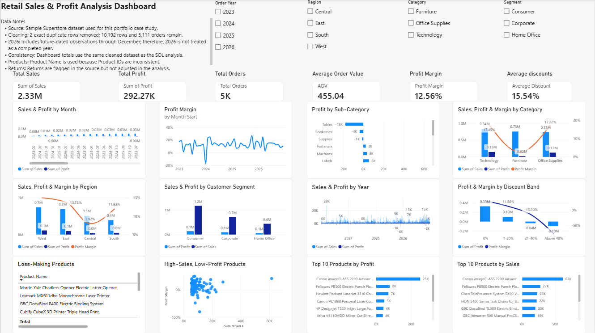
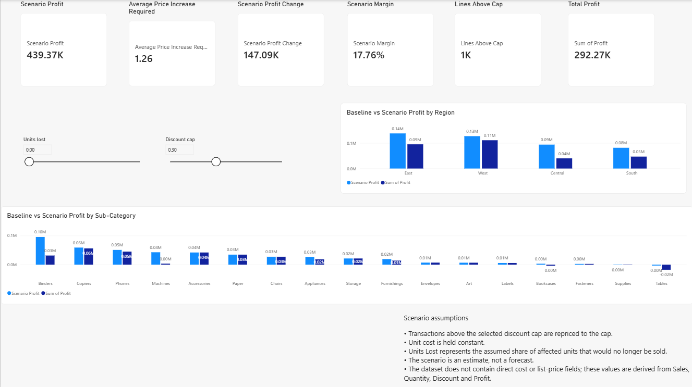
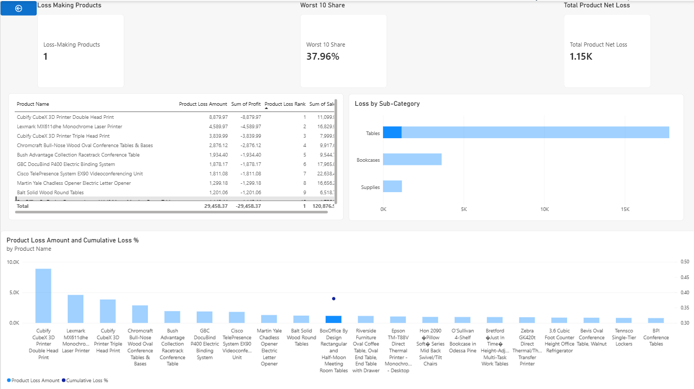

# Retail Sales & Profit Analysis: Dashboard, Business Requirements Document and Discount What-If

A Business Analyst portfolio project using the **Sample Superstore** dataset. The project covers the end-to-end analyst workflow: defining the business problem, documenting requirements and user stories, profiling and cleaning data, analysing business questions with SQL, building an interactive Power BI report with DAX, testing a discount-cap scenario, prioritising product-level losses, and turning the results into evidence-based findings and recommendations.

> **Portfolio disclaimer:** This is a fictional case study built on a public sample dataset. The stakeholders (Senior Management, Sales Manager, Finance Manager, Product Manager, Regional Manager) are assumed. No real stakeholder interviews took place and no real company is represented.



---

## 1. Project Overview

### Deliverables

- Business Requirements Document (BRD)
- 15 functional requirements
- 15 user stories with acceptance criteria
- Requirements Traceability Matrix
- Cleaned dataset
- SQL analysis and validation queries
- Three-page Power BI report
- DAX measures and calculated columns
- Discount What-If scenario analysis
- Loss Priorities and Pareto analysis
- Findings and recommendations

---

## 2. Business Problem

> **"Sales performance is changing, and management wants to understand the factors affecting profitability."**

Management needs a clearer view of:

- sales and profit trends
- category and sub-category profitability
- product-level losses
- regional performance
- customer segment performance
- the relationship between discounting and profitability
- products responsible for concentrated losses

The analysis is designed to support evidence-based discussion rather than claim causation where the dataset cannot establish it.

---

## 3. Business Objectives

The project aims to:

- Show how sales and profit change over time.
- Identify categories, sub-categories and products contributing to profit or loss.
- Identify regions with comparatively weaker profitability.
- Assess whether discounting is associated with lower profitability.
- Quantify the sales and profit associated with higher discount levels.
- Allow a stakeholder to test a discount cap and see an estimated profit change under stated assumptions.
- Identify products and sub-categories responsible for concentrated product-level losses.
- Prioritise areas for management review.
- Translate analytical findings into practical recommendations.

---

## 4. Dataset

**Source:** Sample Superstore public sample retail dataset.

The source workbook contains three sheets:

| Sheet | Rows | Contents |
|---|---:|---|
| Orders | 10,194 | Order-line transaction data including dates, customer, segment, location, product, sales, quantity, discount and profit (21 columns) |
| People | 4 | Regional manager information |
| Returns | 296 | Order IDs flagged as returned |

Order dates in this file run from **2023-01-03 to 2026-12-30** and cover all 48 months. The analysis uses the figures in this file; other versions of the Superstore dataset have different dates and row counts, so numbers will not match them.

### Data Cleaning

The Orders sheet originally contained 10,194 rows.

Two exact duplicate rows were identified and removed, leaving:

- **10,192 order lines**
- **5,111 distinct orders**

No missing values were identified in the source sheets.

### Known Data Limitations

- Order dates extend through December 2026, so 2026 figures require a time-period caveat because the dataset contains future-dated observations relative to the analysis date.
- Returns are flagged at Order ID level, so sales and profit were not adjusted for returns.
- Product IDs and product names are inconsistent (32 Product IDs map to more than one name); product-level analysis therefore uses **Product Name**.
- 200 rows are Canadian and are retained under their assigned regions.
- The dataset does not contain direct cost or list-price fields. The What-If analysis derives list price per unit and cost per unit from Sales, Quantity, Discount and Profit.
- The Harry Olson customer name maps to several Customer IDs, so customer-level analysis is treated as a limitation and is not a core analytical focus.

---

## 5. Tools Used

| Tool | Used for |
|---|---|
| SQL / SQLite / DB Browser for SQLite | Business-question analysis, discount analysis, scenario validation and loss/Pareto analysis (CTEs, joins, window functions) |
| Power BI Desktop | Interactive dashboard and scenario reporting |
| DAX | Measures, calculated columns, calendar table, What-If calculations and Pareto measures |
| Excel | Source-data review and validation |
| Markdown / GitHub | Project documentation and portfolio presentation |

---

## 6. Requirements and Business Analysis

The project contains 15 functional requirements (FR-01 to FR-15) covering the complete final report.
The requirements are supported by:

- BRD
- user stories
- acceptance criteria
- requirements traceability
- SQL analysis
- Power BI visuals
- DAX calculations
- findings and recommendations

### KPI Snapshot

| KPI | Definition | Value |
|---|---|---:|
| Total Sales | Sum of Sales | $2,326,153.86 |
| Total Profit | Sum of Profit | $292,273.46 |
| Profit Margin | Total Profit ÷ Total Sales | 12.56% |
| Total Orders | Distinct count of Order ID | 5,111 |
| Average Order Value | Total Sales ÷ Total Orders | $455.13 |
| Average Discount | Average Discount across order lines | 15.54% |

Full requirements documentation:

- `docs/BRD.md`
- `docs/user_stories.md`
- `docs/traceability_matrix.md`

---

## 7. User Stories

Fifteen user stories with acceptance criteria were written for the assumed stakeholders. Examples:

- *As a Finance Manager, I want to analyze profit by product category so that I can identify categories affecting profitability.*
- *As a Regional Manager, I want to compare my region's sales, profit and margin with the other regions so that I can see whether my region is underperforming.*
- *As a Sales Manager, I want to set a discount cap and see the estimated profit change so that I can judge the profit at stake before proposing a discount policy.*
- *As a Product Manager, I want to see which products and sub-categories account for most of the product-level losses so that I can decide which products to review first.*

Full list: `docs/user_stories.md`. Traceability from story to requirement, visual, dataset fields and business outcome: `docs/traceability_matrix.md`.

---

## 8. Analysis

The SQL analysis answers the core business questions and provides independent validation for the Power BI report.

### Core Analysis

| Analysis | Headline result |
|---|---|
| Sales and profit trend | Jan–Sep 2026 sales were about 21.5% higher and profit about 50.5% higher than Jan–Sep 2025; 2024 sales fell 4.2% from 2023 |
| Profit margin | Overall margin is 12.56%; monthly margin ranges from -17.3% to +27.2%, and only two months (Jul 2023, Jan 2024) lost money |
| Category | Technology (17.45%) and Office Supplies (17.22%) have much higher margins than Furniture (2.61%) |
| Sub-category | Tables (-$17,753), Bookcases (-$3,632) and Supplies (-$1,171) lose money overall |
| Products | 300 of 1,849 products are loss-making on a net product basis (net loss $77,600) |
| Region | Central has the lowest margin (7.92%) against 11.93% to 14.98% elsewhere |
| Segment | Segment margins range only from 11.65% to 14.03% |
| Discount vs profit | Margin falls from 29.6% with no discount to -77.4% above 40% discount |
| High-sales / low-profit | 31 of the top 100 products by sales earn a margin below 5% |
| Quantified discount impact | Lines discounted above 30%: 1,185 lines, -$125,507 net profit |
| Discount What-If | At a 30% cap, the estimated profit change is between +$125,507 (no units on those lines sold) and +$147,093 (all units still sold at the capped price) |
| Loss Pareto | The worst 20 products account for 50.1% of net product-level losses |

### Discount What-If Methodology

The dataset does not contain direct list-price or cost fields.

Therefore:

**List Price per Unit**

`Sales ÷ (Quantity × (1 − Discount))`

**Cost per Unit**

`(Sales − Profit) ÷ Quantity`

As a consistency check, among 1,464 products with at least 3 lines at 2 or more discount levels, the derived list price stayed within 5% across discount levels for 96.0% of products, and the derived cost for 95.8%.

The scenario:

1. Selects a discount cap.
2. Identifies order lines above the selected cap.
3. Reprices those lines to the selected cap.
4. Holds derived unit cost constant.
5. Allows the user to specify an assumed percentage of affected units that are not sold.
6. Calculates estimated scenario sales, profit and profit change.

These results are **estimates, not forecasts**. The analysis does not model customer behaviour, future orders or broader market effects. The upper figure at a 30% cap assumes customers pay about 56.5% more on average on the affected lines, so it is a reference point and not an expectation.

### Loss Priorities Methodology

A product's loss is defined as its **total profit across all order lines when that total is negative**.

Products are identified using Product Name because of inconsistencies in Product ID/name mappings.

The Loss Priorities analysis:

- ranks loss-making products
- calculates cumulative loss concentration
- identifies the worst 20 products
- compares losses by sub-category
- provides a "Fix These First" list of the worst 10 products

---

## 9. Power BI Report

The final Power BI report contains three analytical pages.

### Page 1 — Overview

The Overview page provides the core management dashboard with:

- 6 KPI cards
- Year slicer
- Region slicer
- Category slicer
- Segment slicer
- Sales and Profit by Year
- Sales and Profit by Month
- Profit Margin by Month
- Profit by Sub-Category
- Sales, Profit and Margin by Category
- Top 10 Products by Sales
- High-Sales, Low-Profit Products
- Top 10 Loss-Making Products
- Sales, Profit and Margin by Region
- Sales and Profit by Customer Segment
- Profit and Margin by Discount Band

### Page 2 — Discount What-If

The Discount What-If page allows users to interact with:

- **Discount Cap:** 0%–80%
- **Units Lost:** 0%–100%

It includes:

- Baseline Profit
- Scenario Profit
- Scenario Profit Change
- Lines Above Cap
- Average Price Increase Required
- Profit change by sub-category
- Baseline vs Scenario Profit by region
- permanently visible scenario assumptions

The scenario is explicitly presented as an estimate rather than a forecast.



### Page 3 — Loss Priorities

The Loss Priorities page includes:

- Loss-Making Products
- Total Product Net Loss
- Worst 10 Share
- Top 20 Product Losses — Pareto Analysis
- Loss by Sub-Category
- Fix These First — Top 10 Loss-Making Products

The page is designed to help management focus review efforts on products responsible for a large share of product-level losses.



---

## 10. Key Findings

### 1. Sales and profit are growing, but profitability is volatile

Jan–Sep 2026 sales were about 21.5% higher and profit about 50.5% higher than Jan–Sep 2025, after a 4.2% fall in sales in 2024. Monthly margin ranges from -17.3% to +27.2%, and only two months lost money (Jul 2023 and Jan 2024). Heavier discounting accompanies part of the swings (for example Jan 2024), but the analysis does not explain every month.

### 2. Higher discounts are associated with lower profitability

Margin is 29.6% on lines with no discount and -77.4% on lines above 40% discount. Lines above 20% discount are 15.7% of sales and lost about $136,000 combined. This supports reviewing high-discount transactions, while the analysis does not establish discounting as the sole cause of losses.

### 3. Furniture generates relatively weak profitability

Furniture is 32.4% of sales but 6.7% of profit (margin 2.61%). Tables (-$17,753) and Bookcases (-$3,632) are the main areas of concern within the category.

### 4. Central has the lowest regional margin

Central's margin is 7.92%, against 11.93% to 14.98% in the other regions. 19.7% of its lines carry discounts above 40% (3.6% to 9.6% elsewhere), and those lines lost $40,845, more than the region's total profit of $39,865. The region's category mix and its margin on undiscounted lines are similar to the other regions.

### 5. Losses are concentrated in a few sub-categories

Binders, Tables and Machines account for 64.4% of the losses on loss-making lines while making up 26.0% of sales.

### 6. Customer segments have relatively similar margins

Segment margins differ by only 2.4 percentage points (11.65% to 14.03%). The analysis therefore does not recommend broad segment-level corrective action based on profitability alone.

### 7. Lines discounted above 30% represent substantial profit at stake

Lines above a 30% discount account for **1,185 lines** and **$125,507 in net loss** (a -48.2% margin on $260,286 of sales).

This figure represents observed profit associated with those lines, not a guaranteed saving from changing discount policy.

### 8. Product-level losses are concentrated

The worst 20 products account for approximately **50.1% of net product-level losses**, and the worst 10 for approximately **38.0%** on 5.2% of total sales. Reaching 80% of the loss takes 70 products, so the concentration is meaningful but less extreme than a textbook 80/20 pattern. Several of the worst products lose money at low discounts, which points to price or cost rather than discounting alone.

---

## 11. Recommendations

The recommendations are based only on the observed findings and are proposals to test rather than guaranteed outcomes.

### 1. Add a review step for discounts above 20%

Use a review or approval step for higher discounts, particularly in areas with repeated loss-making transactions. Lines above 30% discount lost $125,507 net, which is the profit at stake, not a savings estimate.

Monitor:

- share of sales above 20% discount
- profit margin
- number of loss-making lines
- changes in profit after any policy change

### 2. Review discounting practice in Central

Review the discount patterns and profitability of Central-region transactions to identify whether specific products, locations or discount practices require attention.

### 3. Review pricing and discount rules for Tables and Bookcases

Investigate pricing, cost and discount combinations for these sub-categories before making changes.

### 4. Review a shortlist of loss-making, high-sales products

Start with the products in the **Fix These First** list, which account for about 38.0% of product-level losses.

For each product, investigate whether the observed loss is associated with:

- discounting
- pricing
- cost structure
- product-specific factors

The available dataset cannot independently establish the cause.

### Measurement

Success should be evaluated using changes in:

- profit margin
- profit
- share of high-discount sales
- loss-making transaction lines
- product-level losses

**Limitations of the conclusions:** the data shows association, not causation. It has no cost data and no evidence on how customers respond to price changes, so scenario figures are estimates under stated assumptions.

---

## 12. Project Structure

```text
superstore-ba-project/
│
├── README.md
│
├── data/
│   ├── sample_-_superstore.xls
│   ├── Superstore_Cleaned.xls.xls
│   ├── superstore_orders_clean.csv
│   └── superstore.db
│
├── docs/
│   ├── project_plan.md
│   ├── BRD.md
│   ├── user_stories.md
│   ├── traceability_matrix.md
│   ├── findings.md
│   └── recommendations.md
│
├── sql/
│   └── superstore_queries.sql
│
├── powerbi/
│   ├── Retail_Sales_Profit_Dashboard.pbix
│   ├── superstore_dax_measures.txt
│   ├── superstore_whatif_dax.txt
│   └── superstore_pareto_dax.txt
│
└── images/
    ├── dashboard.png
    ├── whatif.png
    └── pareto.png
```

## 13. How to Reproduce

1. **SQL:** import `data/superstore_orders_clean.csv` into SQLite as `Orders`, then run `sql/superstore_queries.sql`.
2. **Power BI:** open `powerbi/Retail_Sales_Profit_Dashboard.pbix` in Power BI Desktop. To rebuild, load the cleaned CSV, then create the Calendar table and measures from the three DAX files.
3. **Validation:** with no filters, the report should show Total Sales of approximately $2,326,154, Total Profit of approximately $292,273 and Profit Margin of approximately 12.6%. On Page 2 at a 30% cap and 0% units lost, Profit Change should be approximately +$147,093. On Page 3, Loss-Making Products should be 300 and the worst 10 should represent approximately 38.0% of product-level loss.

---

## 14. Skills Demonstrated

- Requirements documentation: BRD, functional and non-functional requirements, and KPI definitions
- Writing user stories with testable acceptance criteria
- Requirements traceability (story, requirement, visual, data fields, outcome)
- SQL: aggregation, GROUP BY, HAVING, CASE WHEN, CTEs, joins and window functions
- Power BI dashboard design and DAX (measures, calculated columns, date table, What-If parameters, Pareto measures)
- Scenario analysis with stated assumptions and checking those assumptions against the data
- Data profiling and cleaning, and documenting data limitations
- KPI and profitability analysis
- Turning analysis into evidence-based, appropriately cautious recommendations

---

## 15. Portfolio Note

This project demonstrates a complete Business Analyst workflow from **business problem → requirements → data analysis → dashboard → scenario analysis → findings → recommendations**.

The purpose is to demonstrate analytical and business-analysis capability using a public sample dataset. The findings and recommendations should therefore be interpreted as a portfolio case study rather than as advice to a real organisation.

---

**Author:** [Rishika C Datta] · [https://www.linkedin.com/in/rishika-c-datta-b9a477313/] · [https://github.com/rishika-datta]
